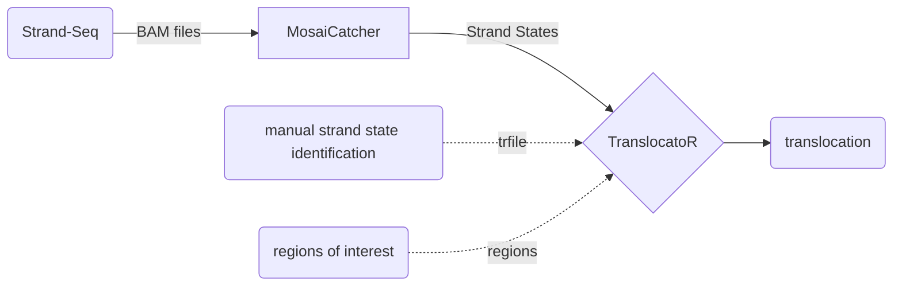

# TranslocatoR

_TranslocatoR finds translocations in MosaiCatcher-processed data. It can be used for both reciprocal and non-reciprocal translocations._

In this README:
* How TranslocatoR Works
* Getting Started
* Using TranslocatoR
* Ready-to-use Example
 

## <a name="how_it_works">How TranslocatoR Works</a>
After processing the data with StrandPhaseR, the MosaiCatcher pipeline outputs a file containing all segments and their phased states. 
This file forms the input to TranslocatoR.  
TranslocatoR has several ways for the detection of co-segregating segments. 
Besides the two main options, pq and majority, a further file of additional inferred strand-states can be provided by the user (trfile) as well as a file containing regions of interest in the sample.    
TranslocatoR performs haplotype splitting for each segment: Note that with the majority option, each chromosome is represented by one ‘segment’ which is the majority state, 
and with the pq option each chromosome is represented by two segments, one for each arm. 
Finally each haplotype of each segment is compared to every other segment’s haplotype.  

TranslocatoR outputs a matrix containing translocations by selecting all segments where p is below a user-chosen cutoff (default 0.01).



## Getting Started
### Installing from GitHub

If you want to use TranslocatoR directly without looking at the usage example first, you can install it directly from GitHub with the devtools() package.
Simply run `devtools::install_github(repo = "https://github.com/friendsofstrandseq/TranslocatoR", ref = "master")`, load the TranslocatoR library with `library(TranslocatoR)` and you're ready to go.

If you would like to do an example run first to get a feel for how TranslocatoR output looks, you need to clone the directory and install the package separately. I have not yet been able to figure out how to make `devtools` install the subfolders necessary for the example to run.
Clone the whole repository into your desired local directory by navigating to it, then running `git clone https://github.com/friendsofstrandseq/TranslocatoR.git`. Inside RStudio, navigate to the directory that now contains the cloned repo and set the `TranslocatoR` directory as your working directory. You can now run `devtools::install()` and TranslocatoR will be installed as normal.  You can then follow the usage example (keeping your working directory set to the cloned TranslocatoR repository folder).

TranslocatoR utilizes the following R packages: ```"data.table", "gtools", "ggplot2", "stringr", "discreteMTP", "assertthat"``` and these will be installed automatically if you do not have them on your machine yet.

Below we provide you with a ready-to-use example <a href="#example">here</a>, as well as some output-context.

## Using TranslocatoR
Execute the following command and make sure to specify non-default arguments if needed.
```r
translocatoR(data.folder, output.folder, samples, options = "pq", binsize = 100000L, cutoff = 0.01, regions = NULL, trfile = NULL, blacklist = T) 
``` 
  
**Argument** | Comment
---------|---------
data.folder	| path to MosaiCatcher data folder
output.folder | absolute path to output folder for TranslocatoR data
samples	| samples in MosaiCatcher output folder to be analyzed by TranslocatoR. Use consistent ID throughout the data-set.
options	| can take one of multiple values "segments", "pq", "majority"; defaults to "pq".
binsize	| which binsize to use, defaults to 100kb
cutoff	| cutoff for significant FDR-corrected p-values, defaults to 0.01
regions	| list of regions in the format "chr#:<start>-<end>" for potential translocations
trfile	| list of manually-identified strand state of suspected translocation
blacklist | List of coordinates for centromeres and short arms for acrocentric chromosomes. Defaults to TRUE and is strongly recommended.

<br> </br> 
**data.folder** should be the path to the MosaiCatcher data folder that contains your sample(s) of choice. If you decide to use other files please ensure the following path-structure
```
|__<your folder>  
    |__strand_states  
    |   |__<sample ID>  
    |       |__<final.txt>
```

**options** 

* ``` pq ``` takes the strand states of the most distal segments on both the p- and q-arms of each chromosome. Translocations are expected to be on the ends of chromosomes.
* ``` majority ``` identifies the majority state (i.e. the most prevalent strand state) of each chromo- some to use for comparison
* ``` segments ``` automatically identifies all recurring segments in a library. This is useful for very complex events. 

**samples** should give distinctive sample-ids. Multiple inputs are possible: ```samples=c("sampleA", "sampleB")```

**regions** File containing regions of interest in a sample. 
These regions are the positions where recurrent strand state changes take place, or one expects to see a more complex translocation. 
TranslocatoR extracts the majority strand state for every given region in each cell and treats the regions as extra segments. 

Provide a file in the following format, multiple sample-id inputs are possible:

sample | chrom | start | end
------|------|------|------
RPE-BM510 | chr12 | 80000 | 900000
C7 | chr5 | 0 | 555666
 
<br> </br>
**trfile** Useful for non-reciprocal translocations: 
the translo- cated portion of a chromosome will look like a duplication and identifying its state is straightforward.  
* Cannot contain more than one sample-id. In order to supply several sample-ids provide several paths for the argument: ```trfile = c("path1", "path2", ...) ```  
* The first two columns of the .txt file must contain the sample- and cell-ids. 
* The states in this file will be treated as an extra segment in each cell. 
 

 sample | cell | chr10tr
--------|------|-------
RPE-BM510|BM510_20306| C
RPE-BM510|BM510_20310| W
RPE-BM510|BM510_20315| W


 
### Output 
The following output file structure will be created:
```
|__<your_output_folder>  
    |__sample-ID                        # creates folder for each given sample
    |   |__haplotypes-per-arm.txt       # raw data output
    |   |__outliers
    |       |__<outliers.txt>           # cells that do not follow the predicted translocation pattern
    |   |__translocations  
    |       |__pvalue-table.txt         # all possible combinations
    |       |__recurrent-segments.txt   # recurring breakpoints that occur > 2x within the data set  
    |       |__translocations.txt       # suggested translocations after applying pvalue cut-off
```

Some insight on how to understand the given output is given <a href="#understand-output">below</a>.

## <a name="example">**Ready-to-use Example**</a>
Here we provide you ready-to-use data for testing TranslocatoR.
Run TranslocatoR yourself:
```r
translocatoR(
    data.folder = "data/example-data/example-input", 
    output.folder = "data/example-data/example-output/your-output", 
    samples = "RPE-BM510",
    options = "majority",
    trfile = "data/example-data/example-input/trfile-example.txt",
    )
```

#### Input #### 
1. MosaiCatcher output-folder structure containing "RPE-BM510" as a sample: ```data/example-data/example-input```
2. Example file containing the manually-identified strand states of the suspected translocation ```data/example-data/example-input/trfile-example.txt```

#### Output ####  
1. We provide you with the expected example-run output: ```data/example-data/example-output/example-run```
2. If you have run TranslocatoR yourself the output can be found here: ```data/example-data/example-output/your-output```


### <a name="understand-output">**Understanding the Output**</a>
`translocation.txt` The primary output-file of interest. 

- **SegA**/**SegB**: chromosomes that are affected by translocation: SegA translocates to SegB, haplotypespecific.
- **cor**: Positive/negative correlation.
- **p**: p-value 
- **x**: Number of matching states.
- **n**: Number of cells.
- **pBH**: FDR-adjusted p-value.

The other output files are useful for further reference, but not crucial.

- `outliers.txt` Outlyer cells that do not match the segregation pattern for any of the identified translocations. Can be used to double-check the listed cells.
- `haplotypes-per-arm-txt` Matrix containing all split haplotypes per cell.
- `pvalue-table.txt` Full matrix of segment comparisons and p-values; no cut-off applied.
- `recurrent-segments.txt` Matrix of recurrent segments (>1x; not entire chr). Lists start-/end-point in N-cells. Can be used to infer breakpoint and thus validate the detected translocations.

#### Understanding the Example Output ####

The output-file of primary interest is `translocations.txt` where TranslocatoR gives a list of detected translocation candidates ordered by FDR-adjusted p-values depending on the set cut-off. This list is affected by the arguments used for the run. 
In our example you can see of the three candidate translocation partners found for the tested segment (specified by `trfile.txt`) `chr10tr chrX.H2` is the most probable partner. This coincides with the previously described translocation der(X)t(X;10) ([Janssen et al., 2011, DOI: 10.1126/science.1210214](http://science.sciencemag.org/content/333/6051/1895)).
Hence, by going back to the data and looking at the candidate translocations in the other files provided by TranslocatoR and the MosaiCatcher pipeline, one can evaluate the candidate translocations.

