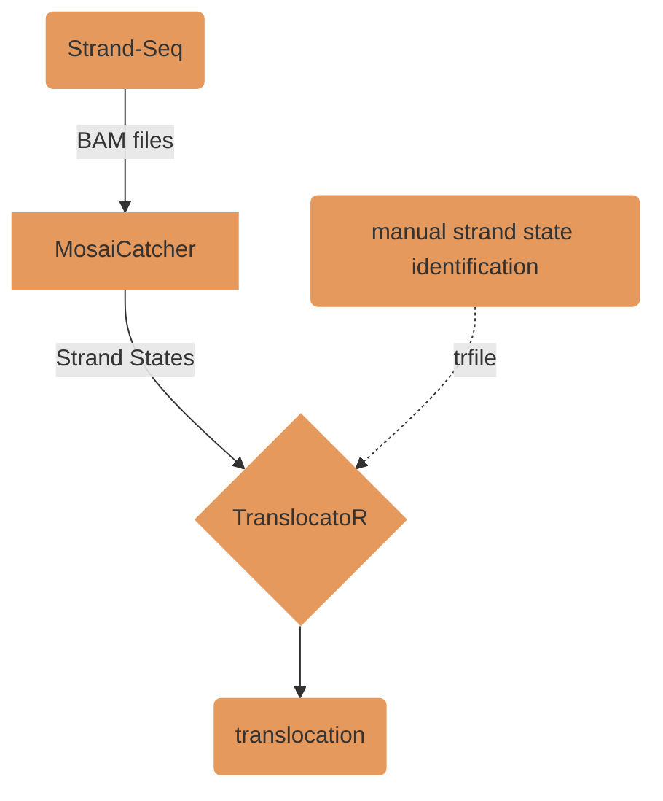

# TranslocatoR

TranslocatoR finds translocations in MosaiCatcher-processed data. It can be used for both reciprocal and non-reciprocal translocations.
For some more detail on the steps TranslocatorR takes to detect translocations <a href="#how_it_works">click here</a>.
## Getting Started
### Prerequeisites
<!---:bangbang:**please update** :bangbang: 
- update steps, it is to be expected that the upcoming version of TranslocatoR will auto-install the required packages/dependencies-->

What you need to install the software. Consult [GitLab help section](https://git.embl.de/help 'GitLab-Help') if needed.
1. Make sure that you own a [SSH-key](https://git.embl.de/help/ssh/README.md) for GitLab 
2. In your terminal navigate to the directory that you wish to clone TranslocatoR to
3. Clone TranslocatoR to that directory 
4. Launch R.Studio and navigate to that your_directory/Translocator/R
5. Execute ``` install ()``` 
6. You will need the following packages: 
    * ```install.packages("data.table", "gtools", "ggplot2", "stringr", "discreteMTP", "assertthat")```
7. Load the needed packages
    * ``` library("TranslocatoR","data.table", "gtools", "ggplot2", "stringr", "discreteMTP", "assertthat")```

## Using TranslocatoR
Execute the following command and make sure to specify non-default arguments if needed.
```
translocatoR(data.folder, output.folder, samples, options = "pq", binsize = 100000L, cutoff = 0.01, regions = NULL, trfile = NULL, blacklist = T) 
``` 
  
**Argument** | Comment
---------|---------
data.folder	| path to MosaiCatcher data folder
output.folder | absolute path to output folder for TranslocatoR data
samples	| samples in MosaiCatcher output folder to be analyzed by TranslocatoR. Use consistent ID throughout the data-set.
options	| can take one of multiple values "segments", "pq", "majority"; defaults to "pq".
binsize	| which binsize to use, defaults to 100kb
cutoff	| cutoff for significant FDR-corrected p-values, defaults to 0.01
regions	| list of regions in the format "chr#:<start>-<end>" for potential translocations
trfile	| list of manually-identified strand state of suspected translocation
blacklist | whether to use the blacklist for centromeres and short arms for acrocentric chromosomes. defaults to True. use is strongly recommended.

<br> </br> 
**data.folder** should be the path to the MosaiCatcher data folder that contains your sample(s) of choice. If you decide to use other files please ensure the following path-structure
```
|__<your folder>  
    |__strand_states  
    |   |__<sample ID>  
    |       |__<final.txt>
```

**options** 

* ``` pq ``` takes the strand state for the end of each arm and compares them all to each other
* ``` majority ```
* ``` segments ``` automatically identifies all recurring segments in a library and compares them to each other. This is useful for very complex events. 

**samples** should give distinctive sample-ids: ```samples=c("RPE-BM510", "C7")```

**regions** to investigate specific regions of a chromosome. Provide a file in the following format, multiple sample-id inputs are possible:

sample | chrom | start | end
------|------|------|------
RPE-BM510 | chr12 | 80000 | 900000
C7 | chr5 | 0 | 555666
 
<br> </br>
**trfile** cannot contain more than one sample-id. In order to supply several sample-ids provide several paths for the argument: ```trfile = c("path1", "path2", ...) ```

The first two columns of the .txt file must contain the sample- and cell-ids.
 
 sample | cell | chr10tr
--------|------|-------
RPE-BM510|BM510_20306| C
RPE-BM510|BM510_20310| W
RPE-BM510|BM510_20315| W
 
### Output 
The following output file structure will be created:
```
|__<your_output_folder>  
    |__sample-ID                        # creates folder for each given sample
    |   |__haplotypes-per-arm.txt       # raw data output
    |   |__outliers
    |       |__<outliers.txt>           # cells that do not follow the predicted translocation pattern
    |   |__translocations  
    |       |__pvalue-table.txt         # all possible combinations
    |       |__recurrent-segments.txt   # recurring breakpoints that occur > 2x within the data set  
    |       |__translocations.txt       # suggested translocations after applying pvalue cut-off
```

Some insight on how to understand the given output is given <a href="#understand-output">below</a>.

## Ready-to-use Example
Here we provide you ready-to-use data for testing TranslocatoR.
Run TranslocatoR yourself:
```
translocatoR(
    data.folder = "/data/example-data/example-input", 
    output.folder = "/data/example-data/example-output/your-output", 
    samples = c("RPE-BM510"),
#   options = "pq",
#   trfile = "/data/example-data/example-input/trfile-example.txt",
    )
```

#### Input #### 
1. MosaiCatcher output-folder structure containing "RPE-BM510" as examplary sample: ```/data/example-data/example-input```
2. Examplary file containing the manually-identified strand states of the suspected translocation ```/data/example-data/example-input/trfile-example.txt```

#### Output ####  
1. We provide you with examplary output: ```/data/example-data/example-output/example-run```
2. If you have run TranslocatoR yourself the output can be found here: ```/data/example-data/example-output/your-output```


### <a name="understand-output">**Understanding the Output**</a>

For this example-data TranslocatoR finds the previously described translocation der(X)t(X;10) ([Janssen et al., 2011, DOI: 10.1126/science.1210214](http://science.sciencemag.org/content/333/6051/1895)). 


## <a name="how_it_works">How TranslocatoR Works</a>

<!--- To-Do 
:bangbang:**space-holder** :bangbang: 
- [ ] Work-flow schematic
- [ ] Short paragraph on working principle


:bangbang:**space-holder please update** :bangbang: 
- [ ] Description of what one can specifically understand from the output files for the given data-set => "understanding the output"
- [x] upload example-data-set into "data-folder" in repository
- [ ] upload trfile-example.txt


-->